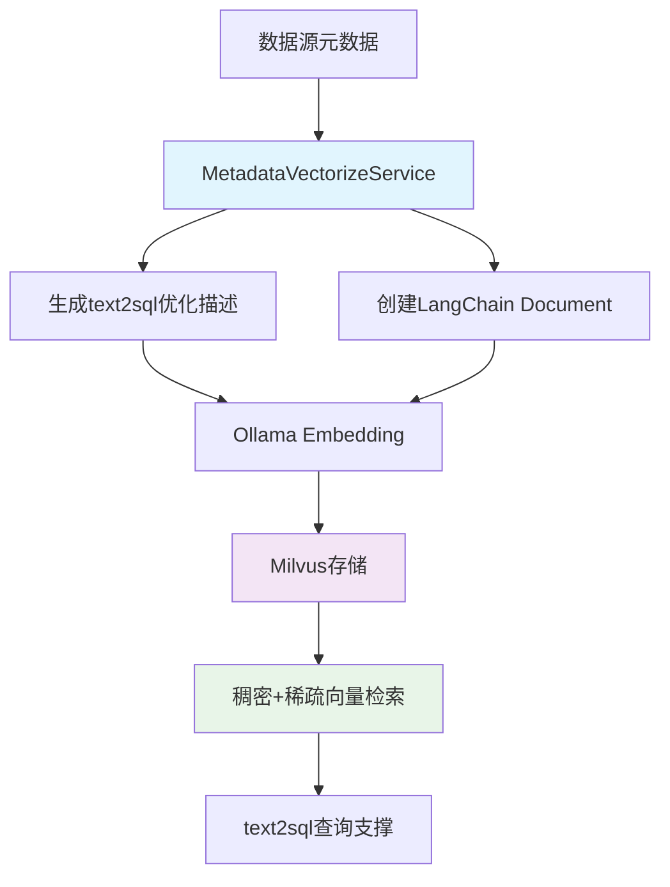

# 元数据向量化功能指南

## 概述

元数据向量化功能基于系统现有的知识库Milvus集成方式，将数据库的元数据（表、列、关系等信息）转换为向量并存储到Milvus向量数据库中，为后续的text2sql功能提供高效的语义检索支撑。

## 功能特性

- 🎯 **智能向量化**：将数据库表、列、关系信息转换为语义向量
- 🔍 **高效检索**：基于Milvus的高性能混合搜索（稠密+稀疏向量）
- 🤖 **text2sql支撑**：为自然语言转SQL提供元数据检索基础
- ⚡ **实时更新**：支持增量更新和全量重建
- 📊 **进度监控**：实时查看向量化进度和状态
- 🔄 **集成复用**：基于现有知识库功能的Milvus集成架构

## 系统架构

### 基于现有Milvus集成

本功能复用了系统中现有的知识库功能的Milvus集成方式：

```
┌─────────────────┐    ┌─────────────────┐    ┌─────────────────┐
│   前端界面      │    │   后端API       │    │   Milvus DB     │
│                 │    │                 │    │                 │
│ - 向量化管理    │◄──►│ - 元数据API     │◄──►│ - 知识库集合    │
│ - 状态监控      │    │ - 向量化服务    │    │ - 元数据集合    │
│ - 搜索测试      │    │ - 检索接口      │    │   (复用架构)    │
└─────────────────┘    └─────────────────┘    └─────────────────┘
                              │
                              ▼
                       ┌─────────────────┐
                       │   Ollama        │
                       │ Embedding Model │
                       │ (复用现有模型)   │
                       └─────────────────┘
```

### 向量化流程



## 环境配置

### 1. Milvus服务（复用现有配置）

系统已配置Milvus服务，元数据向量化将创建独立的集合：

```bash
# 检查现有Milvus服务状态
docker ps | grep milvus

# 如果未启动，使用现有配置启动
docker-compose up -d milvus
```

### 2. Ollama Embedding模型（复用现有配置）

系统已配置Ollama embedding模型，无需额外安装：

```bash
# 检查模型是否可用
ollama list | grep nomic-embed-text

# 如果未安装，拉取模型
ollama pull nomic-embed-text
```

### 3. 环境变量配置

```bash
# 复制环境变量配置
cp env.example .env
```

关键配置项：
```bash
# Milvus配置（复用现有）
MILVUS_URL=http://localhost:19530
METADATA_COLLECTION_NAME=metadata_vectors

# Ollama配置（复用现有）
OLLAMA_EMBEDDING_MODEL=nomic-embed-text
OLLAMA_EMBEDDING_URL=http://localhost:11434
```

## 使用指南

### 1. 向量化数据源元数据

#### 通过Web界面

1. 进入**系统管理** > **数据源管理**
2. 找到目标数据源，点击**元数据管理**按钮
3. 切换到**向量化管理**标签页
4. 点击**开始向量化**按钮
5. 监控向量化进度直至完成

#### 通过API接口

```bash
# 向量化指定数据源的元数据
curl -X POST "http://localhost:8000/api/data-sources/{datasource_id}/metadata/vectorize" \
  -H "Content-Type: application/json" \
  -H "Authorization: Bearer your-token" \
  -d '{
    "include_tables": true,
    "include_columns": true,
    "include_relationships": true,
    "include_indexes": false,
    "include_constraints": false
  }'
```

### 2. 监控向量化状态

```bash
# 获取向量化状态
curl -X GET "http://localhost:8000/api/data-sources/{datasource_id}/metadata/vectorize/status" \
  -H "Authorization: Bearer your-token"

# 获取统计信息
curl -X GET "http://localhost:8000/api/data-sources/{datasource_id}/metadata/vectorize/stats" \
  -H "Authorization: Bearer your-token"
```

### 3. 搜索元数据向量

```bash
# 搜索相关元数据
curl -X POST "http://localhost:8000/api/data-sources/metadata/search" \
  -H "Content-Type: application/json" \
  -H "Authorization: Bearer your-token" \
  -d '{
    "query": "用户信息表",
    "datasource_ids": ["datasource-id-1"],
    "limit": 10
  }'
```

## 向量化配置选项

| 选项 | 说明 | 推荐设置 | text2sql影响 |
|------|------|----------|--------------|
| `include_tables` | 包含表信息 | ✅ 启用 | 影响表名识别和选择 |
| `include_columns` | 包含列信息 | ✅ 启用 | 影响字段名识别和类型推断 |
| `include_relationships` | 包含关系信息 | ✅ 启用 | 影响表关联查询生成 |
| `include_indexes` | 包含索引信息 | ❌ 禁用 | 对text2sql影响较小 |
| `include_constraints` | 包含约束信息 | ❌ 禁用 | 对text2sql影响较小 |

## 向量化数据结构

### 表信息向量化

基于现有embedding模型生成的优化描述：
```text
表名: users (库: main), 业务描述: 用户信息表，存储系统用户的基本信息和状态, 关键词: 用户, 信息, 记录数: 10000条, 主要字段: id, username, email, 主要列: id(int)[用户唯一标识], username(varchar)[用户登录名], email(varchar)[邮箱地址], created_at(timestamp)[创建时间], status(tinyint)[用户状态], 业务字段: username: 用户登录名; email: 邮箱地址; status: 用户状态; created_at: 创建时间
```

### 列信息向量化

```text
字段: users.status, 类型: tinyint, 业务含义: 用户状态, 数据格式: 1=活跃，0=非活跃, 完整说明: 用户状态，1=活跃，0=非活跃，默认为1, 约束: 必填
```

### 关系信息向量化

```text
表关系: orders.user_id 关联 users.id
```

## 技术实现细节

### 1. 向量存储架构

- **复用LangChain-Milvus集成**：基于 `langchain_milvus.Milvus`
- **混合向量支持**：稠密向量（Ollama）+ 稀疏向量（BM25）
- **元数据过滤**：支持按数据源ID进行精确过滤
- **集合隔离**：独立的 `metadata_vectors` 集合

### 2. 文档结构

```python
Document(
    page_content="表名: users, 描述: 用户信息表...",
    metadata={
        "datasource_id": "uuid",
        "item_type": "table|column|relationship",
        "item_name": "users",
        "table_name": "users",
        "raw_data": "{...原始JSON数据...}"
    }
)
```

### 3. 搜索策略

- **加权混合检索**：稠密向量70% + 稀疏向量30%
- **元数据过滤**：支持按数据源ID、项目类型过滤
- **相似度排序**：基于向量距离和BM25分数

## 性能优化

### 1. 向量化性能

- **批量处理**：每批处理100个文档
- **复用连接**：利用现有Milvus连接池
- **增量更新**：仅更新变更的元数据

### 2. 搜索性能

- **索引复用**：利用现有Milvus索引策略
- **缓存机制**：状态信息内存缓存
- **并发处理**：支持多数据源并行向量化

## 与现有功能的集成

### 1. 知识库功能协同

- **共享Milvus实例**：复用现有向量数据库
- **统一Embedding模型**：使用相同的Ollama模型
- **一致的API设计**：遵循现有知识库API模式

### 2. 数据源管理集成

- **无缝UI集成**：在现有数据源管理界面中添加向量化功能
- **状态同步**：与元数据管理状态协调
- **权限复用**：使用现有的用户权限体系

## 故障排除

### 常见问题

#### 1. Milvus连接失败

```bash
# 检查Milvus服务状态
docker ps | grep milvus

# 检查连接配置
echo $MILVUS_URL

# 测试连接
curl http://localhost:19530/health
```

#### 2. Ollama模型不可用

```bash
# 检查Ollama服务
curl http://localhost:11434/api/version

# 检查模型列表
ollama list

# 重新拉取模型
ollama pull nomic-embed-text
```

#### 3. 向量化进度卡住

- 检查数据源连接状态
- 查看应用日志中的错误信息
- 验证元数据获取是否正常

### 监控和调试

```bash
# 查看向量化日志
tail -f logs/app.log | grep vectorize

# 检查Milvus集合状态
# 通过Milvus管理界面或CLI工具

# 测试embedding服务
curl -X POST http://localhost:11434/api/embeddings \
  -d '{"model": "nomic-embed-text", "prompt": "test"}'
```

## API参考

### 向量化相关接口

| 方法 | 路径 | 说明 |
|------|------|------|
| POST | `/api/data-sources/{id}/metadata/vectorize` | 向量化元数据 |
| GET | `/api/data-sources/{id}/metadata/vectorize/status` | 获取向量化状态 |
| GET | `/api/data-sources/{id}/metadata/vectorize/stats` | 获取统计信息 |
| DELETE | `/api/data-sources/{id}/metadata/vectors` | 删除元数据向量 |
| POST | `/api/data-sources/metadata/search` | 搜索元数据向量 |

### 数据模型

```typescript
interface VectorizeRequest {
  include_tables: boolean;
  include_columns: boolean;
  include_relationships: boolean;
  include_indexes: boolean;
  include_constraints: boolean;
}

interface VectorizeResponse {
  success: boolean;
  vectors_count: number;
  collection_name: string;
  processing_time: number;
  message: string;
}
```

## 最佳实践

### 1. 向量化时机

- **新数据源**：添加数据源后立即向量化
- **结构变更**：数据库结构变更后重新向量化
- **定期维护**：建议每周重新向量化以保持数据一致性

### 2. text2sql集成

- **语义匹配**：利用混合搜索匹配用户查询意图
- **上下文增强**：结合向量搜索结果生成更准确的SQL
- **多表关联**：通过关系向量识别表间关联关系

### 3. 运维监控

- **向量数量监控**：定期检查向量数量是否与元数据一致
- **搜索性能监控**：监控向量搜索响应时间
- **存储空间监控**：监控Milvus存储空间使用情况

## 后续开发计划

- [ ] 支持更多embedding模型选择
- [ ] 添加向量质量评估指标
- [ ] 实现增量向量化优化
- [ ] 集成到chatbot的text2sql流程
- [ ] 添加向量化任务调度器
- [ ] 支持自定义向量化规则

## 技术支持

如有问题或建议，请：

1. 查看系统日志获取详细错误信息
2. 参考本文档的故障排除部分
3. 检查Milvus和Ollama服务状态
4. 在项目仓库提交Issue

---

*最后更新时间：2024年12月*
*基于现有知识库Milvus集成架构实现* 